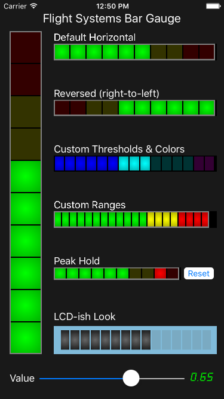

# FDBarGauge

[](https://travis-ci.org/fulldecent/FDBarGauge)

[](LICENSE)



The successor to F3BarGauge


## Background

This control is intended to replicate/simulate the level indicator on an audio mixing board. These indicators are usually segmented/stacked LEDs, with several colors to indicate thresholds. This control replicates that look, using Quartz drawing primitives, and auto-adjusts to horizontal or vertical orientation. Additionally, the colors, number of bars, peak hold, and other items are easily customized. Intended uses include:

 * Realtime data visualization
 * Level bars
 * Single-value charting
 * A VERY simple bar chart (if you use several of these)

## Usage

Adding this control to your XCode project is straightforward:

1.  Add FDBarGauge.swift to your project

2.  Add a new blank subview to your nib/storyboard, sized and positioned to match what the bar gauge should look like.
    
3.  In the properties inspector for this subview, change the class to "FDBarGauge"
    
4.  Below class, change the module to "FDBarGauge"

5.  Add an IBOutlet to your view controller

6.  Update your code to set the value property as appropriate.

For more information have a look at the demo code, which has multiple examples including a version that customizes the with an LCD-style appearance.

Following are all of the customizable properties:

```swift
/// Whether to maintain a view of local maximums
@IBInspectable public var holdPeak: Bool

/// This applies a gradient style to the rendering
@IBInspectable public var litEffect: Bool

/// If `true` then render top-to-bottom or right-to-left
@IBInspectable public var reverseDirection: Bool

/// The quantity to be rendered
@IBInspectable public var value: Double

/// The local maximum for `value`
@IBInspectable public var peakValue: Double

/// The highest possible amount for `value`
@IBInspectable public var maxLimit: Double

/// The lowest possible amount for `value`, must be less than `maxLimit`
@IBInspectable public var minLimit: Double

/// A quantity for `value` which will render in a special color
@IBInspectable public var warnThreshold: Double

/// A quantity for `value` which will render in a special color
@IBInspectable public var dangerThreshold: Double

/// The number of discrete segments to render
@IBInspectable public var numBars: Int

/// Outside border color
@IBInspectable public var outerBorderColor: UIColor

/// Inside border color
@IBInspectable public var innerBorderColor: UIColor

/// The rendered segment color before reaching the warning threshold
@IBInspectable public var normalColor: UIColor

/// The rendered segment color after reaching the warning threshold
@IBInspectable public var warningColor: UIColor

/// The rendered segment color after reaching the danger threshold
@IBInspectable public var dangerColor: UIColor
```

## Installation

Use Swift Package Manager. In Xcode use: File > Swift Packages > Add Package Dependency…

## License

Copyright (c) 2016 William Entriken

Copyright (c) 2011–2014 by Brad Benson

This is released under the MIT licence. Please see the file LICENSE for details.
